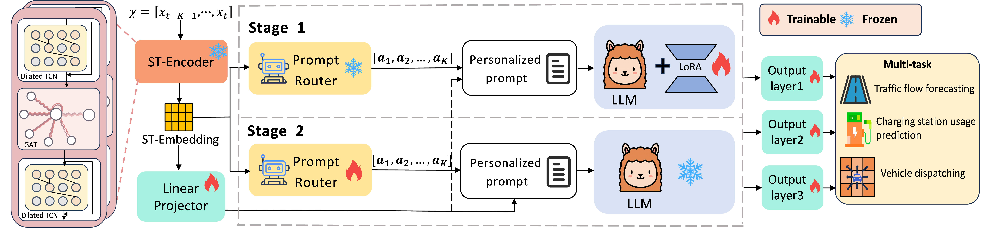
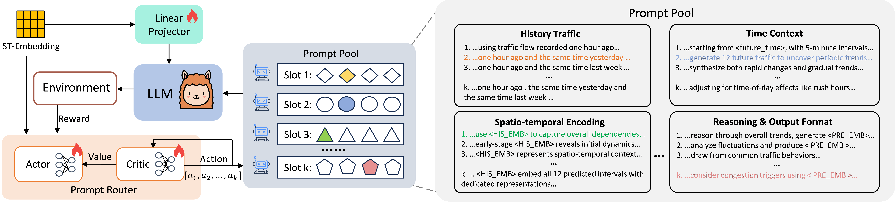

# TransLLM: A Unified Multi-Task Foundation Framework for Urban Transportation via Learnable Prompting

<!-- TODO: 将这里的图片替换为你们项目的Logo或核心架构图 -->


<p align="center">

| **[1 Introduction](#introduction)** 
| **[2 Instance-wise Learnable Prompting](#learnable-prompting)** 
| **[3 Demo vedio](#demo-vedio)** 
| **[4 Requirements](#requirements)**
| **[5 Code structure](#code-structure)** 
| **[6 TransLLM Training](#transllm-training)** 
| **[7 TransLLM Evaluating](#transllm-evaluating)** 
| **[8 Instructions Generation](#instructions-generation)** 
| **[9 Datasets](#datasets)**
| **[10 Citation](#citation)**

</p>

<a id="introduction"></a>

## 1 Introduction
Official code for article [TransLLM: A Unified Multi-Task Foundation Framework for Urban Transportation via Learnable Prompting](https://arxiv.org/abs/YOUR_PAPER_ID)

In this work, our key contributions are:

- We propose TransLLM, a unified foundation framework that integrates spatiotemporal encoding with large language models for diverse transportation tasks, supporting both forecasting and optimization problems.

- We design a lightweight spatiotemporal encoder combining dilated temporal convolutions with dual-adjacency graph attention networks, enabling task-agnostic modeling of complex spatiotemporal dependencies.

- We introduce a learnable instance-level prompt routing mechanism using reinforcement learning, which dynamically assembles personalized prompts based on input characteristics, moving beyond fixed task-wise templates.

- Comprehensive experiments on seven datasets across three transportation tasks demonstrate superior performance over ten baseline methods, with significant improvements in both forecasting accuracy and dispatch efficiency.

The code structure is based on [UrbanGPT](https://github.com/HKUDS/UrbanGPT.git).



<a id="learnable-prompting"></a>

## 2 Instance-wise Learnable Prompting

Our Instance-wise Learnable Prompting is built upon a prompt routing mechanism based on an Actor--Critic reinforcement learning framework. We formulate the construction of a personalized prompt as a multi-step decision process, where the effectiveness of the router relies on a well-designed and diverse prompt candidate pool. This pool is partitioned into $K$ distinct functional slots, each containing multiple candidate sentences that express a similar intent with varied phrasing and focus. For each of these $K$ slots, an independent Actor-Critic network analyzes the unique characteristics of the current input instance and selects the most suitable sentence component. These components are then assembled to form the final personalized prompt tailored for that specific instance.



<a id="demo-vedio"></a>

## 3 Demo Vedio

<video src="./demo.mp4" controls width="600"></video>

<a id="requirements"></a>

## 4 Requirements
```shell
conda create -n transllm python=3.11

conda activate transllm

# Install PyTorch 2.6.0 with CUDA 12.4 support
pip install torch==2.6.0 torchvision==0.21.0 torchaudio==2.6.0

# Install PyTorch Geometric and its dependencies
pip install torch-geometric==2.6.1
pip install pyg_lib torch_scatter torch_sparse torch_cluster torch_spline_conv

# Install Hugging Face Transformers and key ecosystem libraries
pip install transformers==4.41.1
pip install peft==0.10.0
pip install accelerate==0.28.0
pip install bitsandbytes==0.45.3
pip install einops==0.8.1
pip install sentencepiece==0.2.0
pip install safetensors==0.5.2

# Install libraries for large-scale model training and optimization
pip install deepspeed==0.16.3
pip install ray==2.42.0

pip install flash-attn==2.7.2.post1

pip install \
aiofiles==23.2.1 \
aiohttp==3.11.12 \
anyio==4.8.0 \
fastapi==0.115.8 \
fschat==0.2.36 \
gradio==4.44.1 \
h5py==3.12.1 \
matplotlib==3.9.4 \
numpy==1.23.2 \
pandas==2.2.3 \
scikit-learn==1.6.1 \
scipy==1.13.1 \
tensorboardX==2.6.2.2 \
torchdiffeq==0.2.5 \
tqdm==4.67.1 \
wandb==0.19.8 \
PyYAML==6.0.2

# you can install all requirements according to the requirements file.
pip install -r requirements.txt
```

<a id="code-structure"></a>

## 5 Code structure

```
.
|   README.md
|   requirements.txt
|   
+---checkpoints
|   \---st_encoder
|           pretrain_encoder.pth
|    
+---data
|   \---st_data                                 # dataset
|
+---instruction_generation
|       add_window.py
|       dataloader.py
|       instruction_generate_dispatch.py
|       instruction_generate.py
|       load_dataset.py
|       normalization.py
|                  
+---metrics_calculation
|       metrics.py
|       result_test_dispatch.py
|       result_test.py  
|
+---pretrain_encoder
|       pretrain_Enc.py
|
\---transllm
    |   conversation.py
    |   utils.py
    |           
    +---model
    |   |   STLlama_learning_prompt_5dataset.py # model
    |   |   utils.py
    |   |   
    |   \---st_layers
    |           args.py
    |           ST_Encoder.conf
    |           ST_Encoder.py                   # ST-Encoder
    |           __init__.py
    |           
    +---test
    |       run_transllm_dispatch.py            # dispatch task evaluation
    |       run_transllm.py                     # regression tasks evaluation  
    |   
    \---train
            llama2_flash_attn_monkey_patch.py
            stchat_trainer.py
            train_learning_prompt_5dataset.py   # train
            train_st_learning_prompt_5dataset.py
```

<a id="transllm-training"></a>

## 6 TransLLM Training

<a id='Prepare Pre-trained Checkpoint and Data'></a>

### 6.1 Preparing Pre-trained Checkpoint and Data
TransLLM is trained based on following excellent existing models. Please follow the instructions to prepare the checkpoints.
- **Base Models.** 
  Prepare the base model , which serves as the instruction-tuned foundation model in our implementation. We provide several recommended options in the table below. You could download it and put it at ./checkpoints. Additionally, you should download our specific `config.json` file and update the `config.json` file of the base model. The configuration file is available on [Google Drive](https://drive.google.com/file/d/1ngKdAZ0EKmIXJWVYe42KA6TW99XXN7SX/view?usp=drive_link).
  | base model | huggingface address |
  | :--- | :--- |
  | Llama3  | [https://huggingface.co/meta-llama/Llama-3.1-8B-Instruct](https://huggingface.co/meta-llama/Llama-3.1-8B-Instruct) |
  | Vicuna | [https://huggingface.co/lmsys/vicuna-7b-v1.5](https://huggingface.co/lmsys/vicuna-7b-v1.5) |
  | Qwen2  | [https://huggingface.co/Qwen/Qwen2-7B-Instruct](https://huggingface.co/Qwen/Qwen2-7B-Instruct) |
      
  
- **Spatio-temporal Encoder.** 
  We employ a spatio-temporal encoder with a “sandwich” architecture that integrates GAT and TCNs to model complex dependencies. The weights of [st_encoder](https://drive.google.com/drive/folders/111uSBU5P4ZdzCU5OiPSm7xNUfNIaxT3D?usp=drive_link) are pre-trained via multi-task learning across five datasets, enabling it to learn highly generalizable spatio-temporal representations. You could download it and put it at ./checkpoints.
- **TransLLM.** 
[Here](https://huggingface.co/biyunying/TransLLM) is a checkpoint of our TransLLM, based on `Llama 3.1-8B-Instruct` and fine-tuned on the PEMS08 dataset. You can use it directly for inference.
- **Spatio-temporal Train Data.** 
We conduct experiments on five public datasets covering traffic forecasting, charging demand prediction, and vehicle dispatching. We generate all training data by running `instruction_generate.py` and `instruction_generation_dispatch.py`. For comprehensive instructions on the generation process, please refer to the [Instructions Generation](#Instructions-Generation) section below.
The time-series data and adjacency matrices for the PEMS08 and UrbanEV datasets are available [here](https://drive.google.com/drive/folders/12UYMAq7mqoO0GG1vxlSdK7TUmdEaJW_m?usp=drive_link). You could download it and put it at ./data/st_data.

<a id='ST-Encoder PreTraining'></a>

### 6.2 ST-Encoder Pre-training

For the subsequent two-stage training, you can directly utilize the pre-trained ST-Encoder [weights](https://drive.google.com/drive/folders/111uSBU5P4ZdzCU5OiPSm7xNUfNIaxT3D?usp=drive_link) we provide. Our encoder was trained on five datasets. For different datasets, you will need to first train a new encoder by running:

```shell
python pretrain_Enc.py
```


<a id='Two-stage Alternating Training '></a>

### 6.3 Two-stage Alternating Training 

- First stage: fine-tune the LLM; freeze the Prompt Router.

```shell
python train_learning_prompt_5dataset.py --lora_enable True \
                                         --freeze_prompt_router True
```

- Second stage: freeze the LLM; fine-tune the Prompt Router.

```shell
python train_learning_prompt_5dataset.py --lora_enable False \
                                         --freeze_prompt_router False
```

<a id='transllm-evaluating'></a>

## 7 TransLLM Evaluating

<a id='Running Evaluation'></a>

### 7.1 Running Evaluation

You could evaluate your own model by running:
```shell
# regression task
python run_transllm.py --output_model YOUR_MODEL_PATH \
                       --datapath DATA_PATH \
                       --st_data_path ST_DATA_PATH \
                       --res_path RESULT_PATH \ 
                       
# dispatch task
python run_transllm_dispatch.py --output_model YOUR_MODEL_PATH \
                                --datapath DATA_PATH \
                                --st_data_path ST_DATA_PATH \
                                --res_path RESULT_PATH \ 
```

### 7.2 Evaluation Metric Calculation

<a id='Evaluation Metric Calculation'></a>

You can use [result_test.py](./metric_calculation/result_test.py) and [result_test_dispatch.py](./metric_calculation/result_test_dispatch.py) to calculate the performance metrics of the predicted results. 


## 5. Instructions Generation

<a id='Instructions-Generation'></a>

You can use the code in [instruction_generate.py](./instruction_generate/instruction_generate.py) and [instruction_generate_dispatch.py](./instruction_generate/instruction_dispatch.py) to generate the specific instructions you need. For example: 

```
-dataset_name: Choose the dataset. # PEMS08(for training)    PEMS03 (for testing)
# Only one of the following options can be set to True
-for_zeroshot: for zero-shot test or not.
-for_supervised: for supervised training or not.
-for_test: for supervised test or not.
-for_ablation: for ablation study or not.

# Create the instruction data for training
python instruction_generate.py -dataset_name PEMS08

# Create instruction data for the PEMS03 dataset to facilitate testing in the zero-shot setting of TransLLM
python instruction_generate.py -dataset_name PEMS03 -for_zeroshot True
```


<a id="datasets"></a>

## 9 Datasets

Our framework was trained and evaluated across five datasets covering traffic forecasting, charging demand prediction, and vehicle dispatching. To further assess its generalization capability, we conducted zero-shot predictions on two previously unseen datasets, PEMS03 and PEMS04. In total, seven datasets are listed below, while our framework is designed to remain extensible to new datasets and tasks in the future.
<table width="270%" style="border-collapse: collapse; table-layout: fixed;">
<thead>
<tr>
<th width="50%" style="text-align: left; border-bottom: 2px solid #ddd; padding: 8px;">Supporting Tasks</th>
<th width="50%" style="text-align: left; border-bottom: 2px solid #ddd; padding: 8px;">Datasets</th>
<th width="50%" style="text-align: left; border-bottom: 2px solid #ddd; padding: 8px;">Abbreviation</th>
</tr>
</thead>
<tbody>
<tr>
<td rowspan="4" style="font-weight: bold; text-align: left; vertical-align: middle; padding: 8px;">Traffic Forecasting</td>
<td style="padding: 8px;">LargeST-SD</td>
<td style="padding: 8px;"><code>SD</code></td>
</tr>
<tr>
<td style="padding: 8px;">PEMS08</td>
<td style="padding: 8px;"><code>PEMS08</code></td>
</tr>
<tr>
<td style="padding: 8px;">PEMS04</td>
<td style="padding: 8px;"><code>PEMS04</code></td>
</tr>
<tr>
<td style="padding: 8px;">PEMS03</td>
<td style="padding: 8px;"><code>PEMS03</code></td>
</tr>
<tr>
<td rowspan="2" style="font-weight: bold; text-align: left; vertical-align: middle; padding: 8px;">Charging Demand</td>
<td style="padding: 8px;">ST-EVCDP</td>
<td style="padding: 8px;"><code>SZ</code></td>
</tr>
<tr>
<td style="padding: 8px;">UrbanEV</td>
<td style="padding: 8px;"><code>UrbanEV</code></td>
</tr>
<tr>
<td style="font-weight: bold; text-align: left; vertical-align: middle; padding: 8px;">Vehicle Dispatching</td>
<td style="padding: 8px;">Taxi-SH</td>
<td style="padding: 8px;"><code>SH</code></td>
</tr>
<tr>
<td style="font-weight: bold; text-align: left; padding: 8px;">...</td>
<td style="font-weight: bold; text-align: left; padding: 8px;">...</td>
<td style="font-weight: bold; text-align: left; padding: 8px;">...</td>
</tr>
</tbody>
</table>

<a id="citation"></a>

## 10 Citation

If you find our work useful for your research, please cite our paper:

```bibtex
@article{leng2025transllm,
  title={TransLLM: A Unified Multi-Task Foundation Framework for Urban Transportation via Learnable Prompting},
  author={Leng, Jiaming and Bi, Yunying and Qin, Chuan and Yin, Bing and Zhang, Yanyong and Wang, Chao},
  journal={arXiv preprint arXiv:2508.14782},
  year={2025}
}
```
